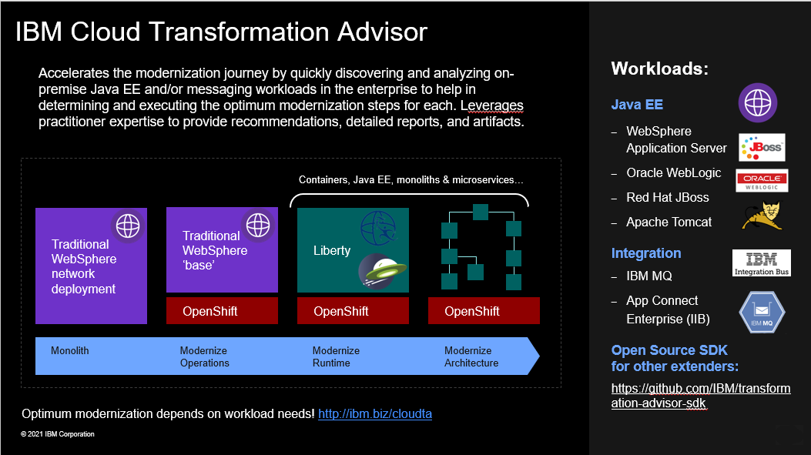
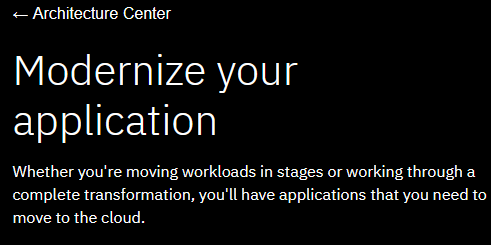
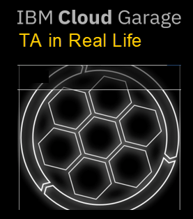
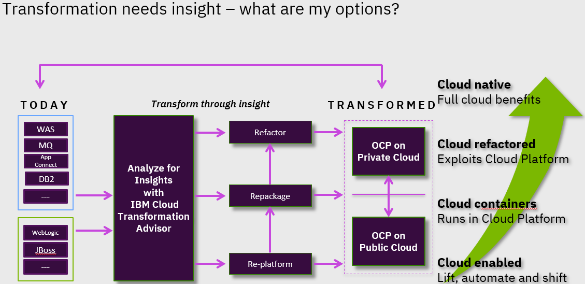

# Assess and analyze existing Applications with IBM Transformation Advisor

** Using IBM Transformation Advisor to assess your application portfolio for modernization recommendations**

IBM Cloud Transformation Advisor helps you to analyze your on-premises workloads for modernization. 
It determines the complexity of your applications, estimates a development cost to perform the move to the cloud, 
and recommends the best target environment.

## 1. Install IBM Transformation Advisor Local to assess your applications!  

 - [Try IBM Transformation Advisor Local](http://ibm.biz/cloudta)

 - [TA sample data collections](https://ibm.box.com/v/TA-SampleDataCollections)
  
    Upload any of the **sample data collection** zip files into **IBM Cloud Transformation Advisor** UI to explore the application assessment capabilities. 
 

  
The process of modernizing applications and moving to the cloud can be a large undertaking. 
Careful planning is needed to prepare business inventory and infrastructure and to determine the best 
path forward for each application. If you don't yet have a cloud platform but are ready to begin the 
assessment for your modernization journey, installing IBM Cloud™ Transformation Advisor locally can 
help you get started. 

 
Transformation Advisor Local is available for local istallation so you can get started quickly to 
assess your applications today. Transformation Advisor runs locally on docker containers on your developer desktop.  

**Transformation Advisor Local** is **FREE** for use! 

 

## 2. Review the IBM Cloud Garage Architecture Center - Detailed Application Moderniztion Methodology

[Modernize Applications methodology and guidance](https://www.ibm.com/cloud/architecture/architectures/application-modernization/)

Modernization comes in many flavors. First, analyze your current application estate and prioritize your modernization goals. 

You can use IBM Cloud Transformation Advisor to analyze and categorize your applications. It provides guidance on the right 
target application server and the amount of effort that is required to start the modernization journey.

Several factors determine an application's path through the modernization phases and where it eventually finishes. 
Among those factors is the number of code changes that are required to move an application to a modern, cloud-ready
application server and the business need for future investment in the application. 

The outcome of the analysis can help you select appropriate modernization patterns.

 
## 3. Use this Transfomation Advisor Guide while while assessing applications

 - [TA Guideance from the field](https://ibm.box.com/v/TA-Real-Life-Guide)
 
 - [Recorded training on usng the TA Guide](https://ibm.box.com/v/TA-Real-Life-Guide)

DAVE, add some words about the guide and the recorded guidance from Cloud garage! 

## 4. Deliver App Mod Recommndations to your Customer

 - [Sample presentation for walkthrough of app mod assessment with customer](https://ibm.box.com/v/sample-assessment-presentation)

**ACTION!** Modify the **sample presentation deck** above as a guide for delivering the insights and recommendatins gained from the Application Assessments from Transfromation Advisor. 

Modernization begins with a good strategy that includes application transformation and prioritizes DevOps, management, 
and infrastructure. 

Transformation Advisor helped you and your client begin the transformation journey in these key areas:

**Assessment**
 
 - Applications evaluated based on business needs
  - High-level inventory of application content and structure
  - Potential issues and migration complexity assessments

**Strategic Planning**
  
  - Identification of key applications that require replacement or upgrade
  - Estimated effort for resolving migration issues
  - Recommendations for a modernization path

Now it is up to you to help your customer get a jump-start 
on modernizing their enterprise, and start benefiting from these insights and navigational guidance for a journey to cloud!

