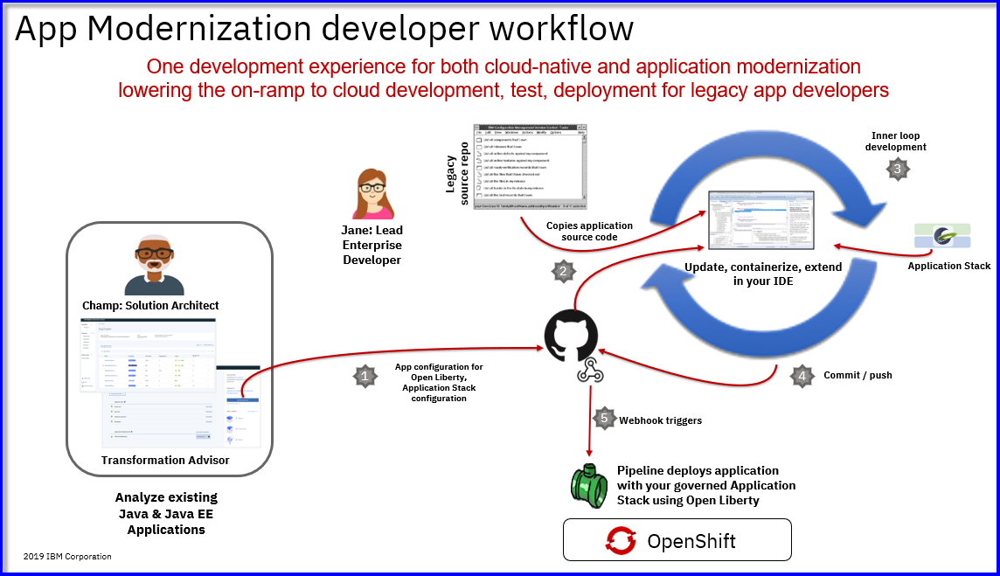
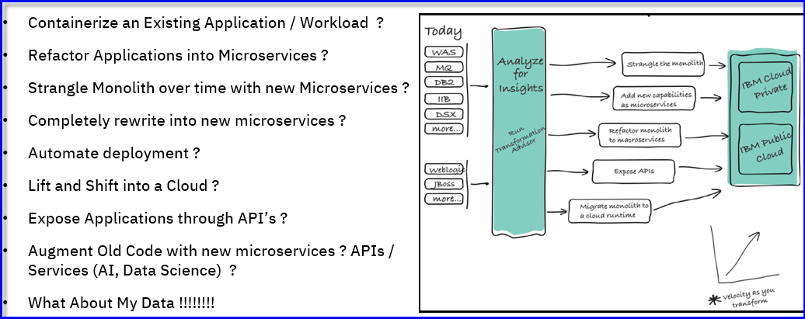

# Modernize Existing Applications with IBM Transformation Advisor and IBM Cloud Pak for Applications 

   

## Modernize existing Java Workloads

** Using IBM Transformation Advisor to assess your application portfolio for modernization recommendations**

IBM Cloud Transformation Advisor helps you to analyze your on-premises workloads for modernization. 
It determines the complexity of your applications, estimates a development cost to perform the move to the cloud, 
and recommends the best target environment.

### Understanding the value of IBM Transformation Advisor

**2 minutes** 

<iframe width="560" height="315" src="https://www.youtube.com/embed/tWGQIv9wtoY" frameborder="0" allow="accelerometer; autoplay; encrypted-media; gyroscope; picture-in-picture" allowfullscreen></iframe>
  
   
  
### Quick demonstration: How to use Transfomration Advisor to assess my WebSphere Applications
  

 
See for yourself how IBM Transfromation Advisor is used to easily assess your existig WebSphere workloads and delivers insights into the feasabilty of modernizing the applications for containers and cloud. 

  

**7 minutes**

<iframe width="560" height="315" src="https://www.youtube.com/embed/unXUwbnwMVw" frameborder="0" allow="accelerometer; autoplay; encrypted-media; gyroscope; picture-in-picture" allowfullscreen></iframe>
  
   

### Quick demonstration: How to use IBM Transformation Advisor's migration plan to facilitate moving your application to containers and RedHat OpenShift Platform

See for yourself how using IBM Transformation Advisor and its automatic generation of a migration bunlde can assist with containerization and deployment to RedHat OpenShift Platform. 

The migration bundle includes generated artifacts that assist with building, configuring, and deploying the application to WebShhere Liberty on the RedHat OpenShift Platform via integrated application stacks and pipelines with IBM Cloud Pak for Applications. 

 

**8 minutes**

<iframe width="560" height="315" src="https://www.youtube.com/embed/kJRAC2GW2Ss" frameborder="0" allow="accelerometer; autoplay; encrypted-media; gyroscope; picture-in-picture" allowfullscreen></iframe>

 

# Guided Tutorials 

## 1. Application Modernization - Assessment Phase

**Gain valuable insights into applications during application modernization "Assessment" phase. ** 

- [Launch Tutorial: IBM Transformation Advisor - Application Assessment](https://www.ibm.com/cloud/garage/dte/tutorial/cloud-enabled-use-case-app-modernization-journey-part-1)

This tutorial focuses on the application assessment (evaluation) phase of application modernization for Java workloads to cotainer and cloud.
You will use IBM Transformation Advisor to evaluate on-premises Java applications and identify a migration candidate for moving to the cloud. 

 

## 2. Application Modernization - Re-Platform Phase

**Gain valuable insights into applications during application modernization "Assessment" phase. ** 

- [Launch Tutorial: IBM Transformation Advisor - Re-Platform](https://www.ibm.com/cloud/garage/dte/tutorial/cloud-enabled-use-case-modernize-java-apps-using-ibm-transformation-advisor-and-cloud-pak)

IBM Transformation Advisor bridges the gap between 
existing development activities and cloud-native development together with the ‘Accelerators for Teams’ in 
the IBM Cloud Pak for Applications (ICPA).  Transformation Advisor will accelerate the development process 
by creating the configuration and deployment artifacts for an application, then facilitate the developer’s 
use of the enhanced developer productivity tools in IBM Cloud Pak for Applications.   

 
This tutorial brings the cloud-native development experience from the “Create and Deploy a Cloud Native App to 
IBM Cloud Pak for Applications (ICPA)” lab, which develops a cloud native microservice application using the 
nodejs-express and java-spring-boot Application Stacks, to the modernization of existing application. 

 

## 3. FREE! Try IBM Transformation Advisor Local to assess your applications yourself!  

 - [Try IBM Transformation Advisor Local](http://ibm.biz/cloudta)

 - [TA sample data collections](https://ibm.box.com/v/TA-SampleDataCollections)
  
    Upload any of the **sample data collection** zip files into **IBM Cloud Transformation Advisor** UI to explore the application assessment capabilities. 
 

  
The process of modernizing applications and moving to the cloud can be a large undertaking. 
Careful planning is needed to prepare business inventory and infrastructure and to determine the best 
path forward for each application. If you don't yet have a cloud platform but are ready to begin the 
assessment for your modernization journey, installing IBM Cloud™ Transformation Advisor locally can 
help you get started. 

 
Transformation Advisor Local is available for local istallation so you can get started quickly to 
assess your applications today. Transformation Advisor runs locally on docker containers on your developer desktop.  

**Transformation Advisor Local** is **FREE** for use! 

 

## 4. FREE! Get the IBM Application Modernization Field Guide

 - [IBM Application Modernization Field Guide](https://www.ibm.com/cloud/architecture/content/field-guide/app-modernization-field-guide/)

Business pressures demand faster time to market and app modernization. IBM can make this easy for you and bring immediate benefits:

  - Accelerate digital transformation. App modernization is driven by the need to transform business to build new capabilities and deliver them quickly.
  
  - Improve developer productivity. Enabling self service for developers through adoption of cloud native and containerization.
    
  -	Improve operational efficiency and standardization. DevOps enablement drives a culture of automation and transformation of operations.

Rewriting your entire estate is a pipe dream. Modernization comes in many flavors. IBM’s skills and experience in middleware provide unique insights and approaches to modernize your existing estate with speed, confidence, and reduced risk. View your development investments as an asset, not a liability.

Refactor what’s necessary, but don’t necessarily refactor.

  