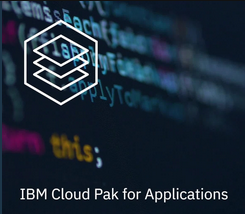

# IBM Cloud Pak for Applications

The **IBM Cloud Pak™ for Applications** provides a hybrid foundation that is built on open standards, 
and enables workloads and data to run anywhere. It includes a self-service environment that combines 
open source tools with your existing middleware for continuous integration and delivery, compliance, 
and visibility across secure, hybrid, multi-cloud environments. 

You can use it to modernize your existing 
applications and develop new cloud-native applications for deployment on any cloud. 

## The value of IBM Cloud Pak for Application

Introducing the value that IBM Cloud Pak for Application brings to the enterprise.

5 minutes 

<iframe width="560" height="315" src="https://www.youtube.com/embed/zrjc1QcGZbQ" frameborder="0" allow="accelerometer; autoplay; encrypted-media; gyroscope; picture-in-picture" allowfullscreen></iframe>

 

## Overview of IBM Cloud Pak for Applications

This session provide an overview the IBM Cloud Pak for Applications and the primary use cases: 

  - Running existing apps
  - modernizing apps
  - building new cloud-native apps
  
30 minutes 
  
 <iframe width="560" height="315" src="https://www.youtube.com/embed/6Tdmh1JsoVI" frameborder="0" allow="accelerometer; autoplay; encrypted-media; gyroscope; picture-in-picture" allowfullscreen></iframe>
  
 

## Cloud Pak Experiences - Free trial to IBM hosted environment

Log in with your IBMid to start your free 7-day trial.

[Cloud Pak Experiences Hosted Environment](https://www.ibm.com/cloud/paks/experiences/cloud-pak-for-applications/)

See how the IBM Cloud Paks can accelerate your journey to the cloud with access to a hosted environment.

Through this series of guided tours, you can experience some of IBM Cloud Pak for Applications core capabilities
to help you modernize your existing applications and develop cloud-native applications that run on Red Hat® OpenShift®. 

